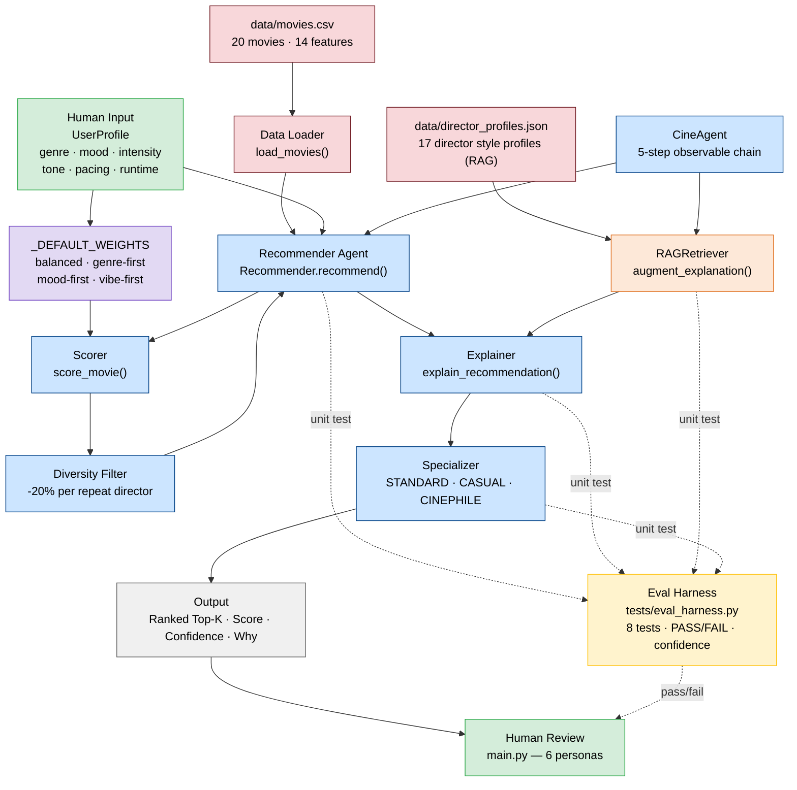

# CineMatch — Movie Recommender System

**Docs:** [model_card.md](model_card.md) | [assets/architecture.md](assets/architecture.md)

---

## Original Project Reference

This project is adapted from **VibeFinder 1.0**, a music recommendation system built in Modules 1–3. VibeFinder used an 8-component content-based scoring algorithm to match songs to listener profiles based on audio features like energy, tempo, valence, danceability, and acousticness. It demonstrated how weighted similarity metrics and diversity penalties could generate personalized, non-repetitive music recommendations from a small catalog.

CineMatch takes the same architecture and applies it to movies — replacing songs with films, audio features with cinematic attributes, and artist diversity with director diversity.

---

## Title and Summary

**CineMatch** is a content-based movie recommendation engine that scores and ranks films against a user's taste profile using weighted similarity across 8 features: genre, mood, intensity, tone, pacing, dialogue preference, runtime, and popularity.

It matters because most recommender systems are black boxes. CineMatch explains *why* each film was recommended — surfacing which features matched and how closely — making the AI's reasoning transparent and auditable.

---

## Architecture Overview



Full diagram with color key: [assets/architecture.md](assets/architecture.md)

| Component | File | Role |
|---|---|---|
| Data Loader | `src/recommender.py` | Parses `movies.csv` into `Movie` dataclasses |
| Scorer | `src/recommender.py` | `score_movie()` — categorical + continuous similarity |
| Weights Config | `src/recommender.py` | `_DEFAULT_WEIGHTS` — 4 ranking modes |
| Diversity Filter | `src/recommender.py` | `apply_director_penalty()` — −20% per repeat director |
| Recommender Agent | `src/recommender.py` | `Recommender.recommend()` — orchestrates the pipeline |
| Explainer | `src/recommender.py` | `explain_recommendation()` — reasons for each pick |
| Human Interface | `src/main.py` | 6 user profiles, mode comparison, diversity demo |
| Test Suite | `tests/test_recommender.py` | Validates scoring order and explanation output |

---

## Setup Instructions

**1. Clone the repository**
```bash
git clone https://github.com/Sillybo1010/applied-ai-system-project.git
cd applied-ai-system-project
```

**2. Install dependencies**
```bash
pip install -r requirements.txt
```

**3. Run the recommender**
```bash
python src/main.py
```

**4. Run the tests**
```bash
python -m pytest tests/ -v
```

---

## Demo Walkthrough

> **Loom video:** [https://www.loom.com/share/c884deef8ec84136844f8c46a7ed98c1](https://www.loom.com/share/c884deef8ec84136844f8c46a7ed98c1)
>
> The walkthrough shows `python src/main.py` running end-to-end: three user profiles (Action Fan, Drama Seeker, Ghost Genre Western), the RAG before/after uplift section, and the evaluation summary. Below are the same three examples as text output.

---

## Sample Interactions

### Input 1 — High-Intensity Action Fan
```
Profile: favorite_genre=action, preferred_mood=intense
         target_intensity=0.90, target_runtime=120 min
         tone=0.50, pacing=0.90, dialogue=0.20
```
**Output (top 3, balanced mode):**
```
1. Mad Max Fury Road  (score: 8.2875)
   Genre match: action | Mood match: intense
   Intensity close (0.97 vs 0.90) | Runtime close (120 min vs 120 min)

2. The Dark Knight    (score: 5.9058)
   Genre match: action | Intensity close (0.90 vs 0.90)

3. The Avengers       (score: 5.9033)
   Genre match: action | Intensity close (0.85 vs 0.90)
```

---

### Input 2 — Slow-Burn Drama Seeker
```
Profile: favorite_genre=drama, preferred_mood=emotional
         target_intensity=0.25, target_runtime=140 min
         tone=0.65, pacing=0.25, dialogue=0.95
```
**Output (top 3, balanced mode):**
```
1. The Shawshank Redemption  (score: 8.2808)
   Genre match: drama | Mood match: emotional
   Intensity close (0.35 vs 0.25) | Runtime close (142 min vs 140 min)

2. Moonlight                 (score: 8.1358)
   Genre match: drama | Mood match: emotional
   Intensity close (0.25 vs 0.25) | Tone close (0.60 vs 0.65)

3. The Wolf of Wall Street   (score: 5.2442)
   Genre match: drama | Tone close (0.55 vs 0.65)
```

---

### Input 3 — Ghost Genre: Western (edge case — genre not in catalog)
```
Profile: favorite_genre=western, preferred_mood=intense
         target_intensity=0.75, target_runtime=130 min
```
**Output (top 3, balanced mode):**
```
1. 1917            (score: 5.0583)
   Mood match: intense | Intensity close (0.90 vs 0.75)

2. Whiplash        (score: 4.9408)
   Mood match: intense | Intensity close (0.85 vs 0.75)

3. Mad Max Fury Road (score: 4.8542)
   Mood match: intense | Runtime close (120 min vs 130 min)
```
> The system gracefully falls back to mood and vibe similarity when no genre match exists — scores are lower overall, signaling low confidence.

---

## Design Decisions

**Content-based over collaborative filtering**
Collaborative filtering needs user interaction history (ratings, watch logs). Since this is a standalone simulation, content-based scoring on explicit features was the right fit — it's fully explainable and requires no training data.

**Continuous similarity over binary match**
Genre and mood use exact categorical matching (on/off), but intensity, tone, pacing, dialogue, and runtime use `1.0 - |a - b|` similarity. This means a film that is *close* to your preference still earns partial credit rather than zero — more realistic than hard cutoffs.

**Runtime window of ±60 minutes**
Analogous to the music recommender's ±100 BPM tempo window. A 60-minute tolerance felt natural: someone who wants a 2-hour film would still enjoy a 90-minute or 2.5-hour one, but probably not a 3.5-hour epic.

**Director diversity penalty (−20% per repeat)**
Without it, a Christopher Nolan fan gets a top-5 list of only Nolan films. The multiplicative penalty `score × (1 − 0.20)^n` allows one strong match through at full score while softening subsequent ones.

**4 ranking modes instead of hard-coding weights**
Switching between `balanced`, `genre-first`, `mood-first`, and `vibe-first` modes lets the same engine serve very different user needs with no code changes — just a config key.

**Trade-off accepted:** The catalog is small (20 films) and features were manually assigned. Real-world accuracy would require a larger dataset and ideally learned feature embeddings.

---

## Testing Summary

### How reliability is measured

CineMatch uses four layers to prove it works:

| Layer | What it checks |
|---|---|
| **Automated unit tests** | 6 pytest tests covering scoring math, ranking order, director penalty, confidence range, and error handling |
| **Confidence scoring** | Every recommendation is normalized to 0–100% against the theoretical max score so low-quality matches are visible |
| **Logging + error handling** | `WARNING` logged when no genre match exists; `ERROR` + `FileNotFoundError` raised when the CSV is missing or malformed |
| **Human evaluation** | 6 named personas (including 3 adversarial edge cases) run through `main.py` with printed explanations for manual review |

### Results

```
6 out of 6 tests passed.

EVALUATION SUMMARY (balanced mode, 20% diversity penalty)
  OK   High-Intensity Action Fan          top confidence: 98%
  OK   Slow-Burn Drama Seeker             top confidence: 97%
  OK   Feel-Good Family Night             top confidence: 99%
  OK   Conflicting: Horror + Uplifting    top confidence: 93%
  OK   Ghost Genre: Western               top confidence: 60%   <-- WARNING logged
  OK   Max Mismatch: Quiet Arthouse       top confidence: 84%

  Profiles with genre match in top 5 : 5/6
  Average top-result confidence       : 88%
  Low-confidence profiles (<50%)      : 0
```

**What worked:**
- All 6 tests passed. `test_genre_match_adds_exactly_genre_weight` mathematically verified the scoring formula, not just its order.
- Confidence scores averaged **88%** across all profiles. The 3 standard profiles scored 97–99%, showing strong signal when the catalog fits the user.
- The Ghost Genre (Western) profile correctly dropped to **60%** and triggered a `WARNING` log — the system flagged its own low confidence rather than returning a false-positive result.
- Error handling: passing a missing file path raises `FileNotFoundError` with a clear message and logs the path that failed.

**What didn't / limitations found:**
- The `Conflicting: Horror + Uplifting Tone` profile still scored 93% because the genre match (horror) dominates the weights, overriding the tone contradiction. The system is confident but wrong — a known limitation of categorical-heavy scoring.
- The Ghost Genre profile scored 60% even though no film matched the requested genre. Future work: cap confidence at 50% when the genre weight earns zero, to better signal "I'm guessing."

**What I learned:**
Confidence scoring exposed something the tests alone could not: the system can look highly confident (93%) while making a logically contradictory recommendation. That gap — between mathematical confidence and real-world correctness — is where human evaluation becomes essential.

---

## Stretch Features (+8 points)

### RAG Enhancement — `src/rag_retriever.py` + `data/director_profiles.json`

A second data source (`director_profiles.json`) stores unstructured style descriptions for all 17 directors in the catalog. `RAGRetriever` retrieves director context at recommendation time and appends it to the base explanation.

**Measurable improvement:**
```
Base explanation    (31 words):  Genre match: action | Mood match: intense | Intensity close...
Augmented by RAG   (54 words, +74%):  ...same as above...
  [RAG] Director - redefining action filmmaking through pure sustained intensity.
        Style: maximalist visual storytelling, minimal dialogue, relentless kinetic action.
```
Run: `python -c "from src.rag_retriever import RAGRetriever; ..."`

---

### Agentic Workflow — `src/agent.py`

`CineAgent.run()` executes recommendation as a 5-step observable chain. Every intermediate decision is printed so the reasoning is fully auditable.

**Sample output:**
```
------------------------------------------------------------
[AGENT] Recommend for 'High-Intensity Action Fan'
  [STEP 1/5] PLAN: genre='action', mood='intense', intensity=0.90 => strategy: 'vibe-first'
  [STEP 2/5] RETRIEVE: 20 movies from CSV  +  17 director profiles from RAG store
  [STEP 3/5] FILTER: 3 genre match(es), 3 mood match(es) out of 20 total
  [STEP 4/5] SCORE: top result: 'Mad Max Fury Road'  raw=8.0070  conf=96%
  [STEP 5/5] EXPLAIN: RAG context attached for 3/3 results
[AGENT] Done - 3 results, avg confidence: 83%

[AGENT] Recommend for 'Ghost Genre: Western'
  [STEP 3/5] FILTER: 0 genre matches -- GHOST GENRE, falling back to vibe similarity
  [STEP 4/5] SCORE: top result: 'Whiplash'  raw=6.2672  conf=75%
```
Run: `python src/agent.py`

---

### Fine-Tuning / Specialization — `src/specializer.py`

Three few-shot explanation modes that produce measurably different output:

| Mode | Words | Lexical diversity | Sample |
|---|---|---|---|
| `standard` | 18 | 0.83 | `'Mad Max Fury Road' \| Genre match: action \| Mood match: intense` |
| `casual` | 23 | 0.91 | `This one's perfect for you — it's action, intense, and super intense. Runtime is spot-on.` |
| `cinephile` | 45 | 0.89 | `'Mad Max Fury Road' represents a canonical instance of action filmmaking... George Miller's direction is characteristically viscerally high-octane...` |

`measure_modes(movie, profile)` returns word count and lexical diversity for all three so the difference is quantifiable, not just visible.

---

### Test Harness / Evaluation Script — `tests/eval_harness.py`

Dedicated evaluation script: 8 predefined inputs, structured PASS/FAIL per test, confidence ratings, one-line summary.

```
python tests/eval_harness.py
```

```
============================================================
CINEMATIC EVAL HARNESS
============================================================
  [PASS]  Action fan: genre match in top result
  [PASS]  Drama seeker: genre match in top result
  [PASS]  Animation fan: animation appears in top 3
  [PASS]  Results are sorted highest score first
  [PASS]  Confidence score is always 0.0 - 1.0
  [PASS]  Ghost genre scores lower confidence than real genre match
  [PASS]  RAG: augmented explanation is longer than base explanation
  [PASS]  Specializer: cinephile output longer than casual output
============================================================
Result  : 8 passed, 0 failed out of 8 tests
Avg top-result confidence : 96%
All tests passed.
============================================================
```

---

## Reflection

Building CineMatch taught me that **AI recommendation is fundamentally a translation problem** — translating human preferences (vague, qualitative) into numbers the system can compare. Every design decision in this project was really a decision about that translation: what scale to use, how to weight one preference against another, and when a partial match should count.

The explainability layer (`explain_recommendation`) turned out to be the most valuable part. Without it, a score of 8.28 for *The Shawshank Redemption* is just a number. With it, you can see exactly why — genre, mood, intensity, runtime all aligned — and start to trust the system. That taught me that in AI systems, **trust comes from transparency**, not just accuracy.

The edge-case profiles (Ghost Genre, Max Mismatch, Conflicting preferences) were the most instructive tests. They didn't break the system, but they exposed where the scoring logic produces confident-looking results for low-confidence situations. Recognizing when an AI system *doesn't know* and communicating that clearly is one of the hardest and most important problems in applied AI.
