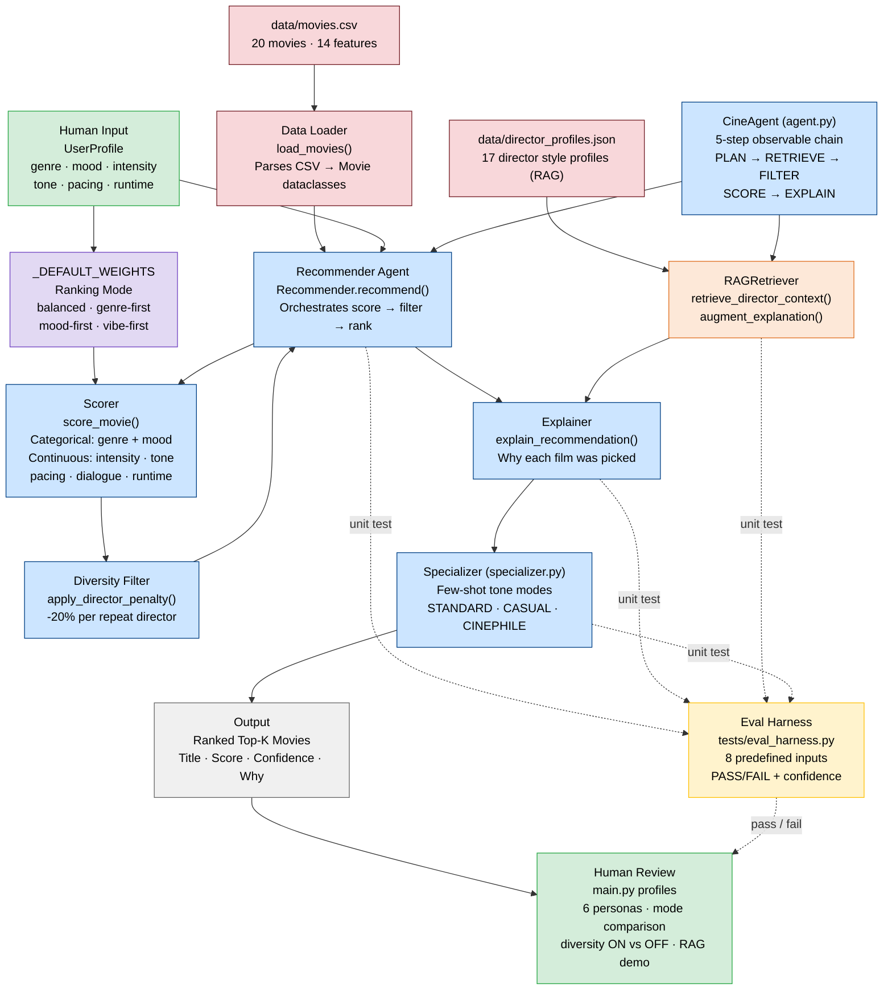

# CineMatch — System Architecture Diagram

**Color key**
- Green — human involvement (input profiles, review)
- Blue — AI/processing pipeline (recommender, agent, explainer, specializer)
- Orange — RAG layer (director profile retrieval)
- Red — data layer (CSV + loader)
- Purple — configuration (weights / ranking modes)
- Yellow — evaluation / testing layer
- Dotted arrows — test hooks validating AI outputs
